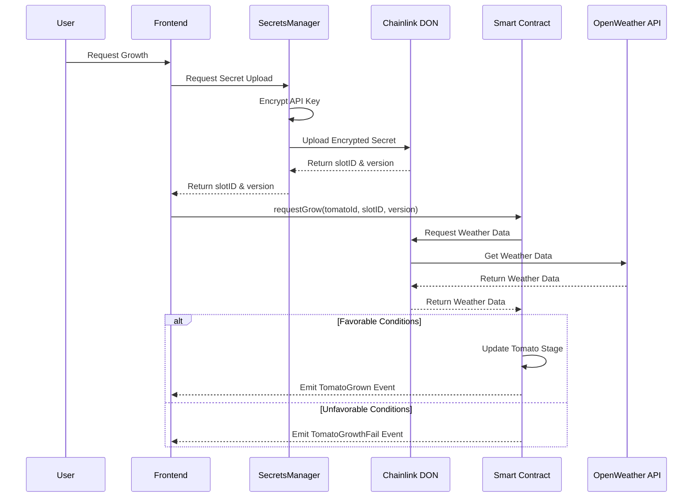

# DynamicTomatoes NFT

Unina Blockchain & DApps course's project work

[...]

```mermaid
sequenceDiagram
    participant User
    participant Frontend
    participant SecretsManager
    participant DON as Chainlink DON
    participant Contract as Smart Contract
    participant Weather as OpenWeather API

    User->>Frontend: Request Growth
    Frontend->>SecretsManager: Request Secret Upload

    SecretsManager->>SecretsManager: Encrypt API Key
    SecretsManager->>DON: Upload Encrypted Secret
    DON-->>SecretsManager: Return slotID & version
    SecretsManager-->>Frontend: Return slotID & version

    Frontend->>Contract: requestGrow(tomatoId, slotID, version)
    Contract->>DON: Request Weather Data
    DON->>Weather: Get Weather Data
    Weather-->>DON: Return Weather Data
    DON-->>Contract: Return Weather Data

    alt Favorable Conditions
        Contract->>Contract: Update Tomato Stage
        Contract-->>Frontend: Emit TomatoGrown Event
    else Unfavorable Conditions
        Contract-->>Frontend: Emit TomatoGrowthFail Event
    end
```
