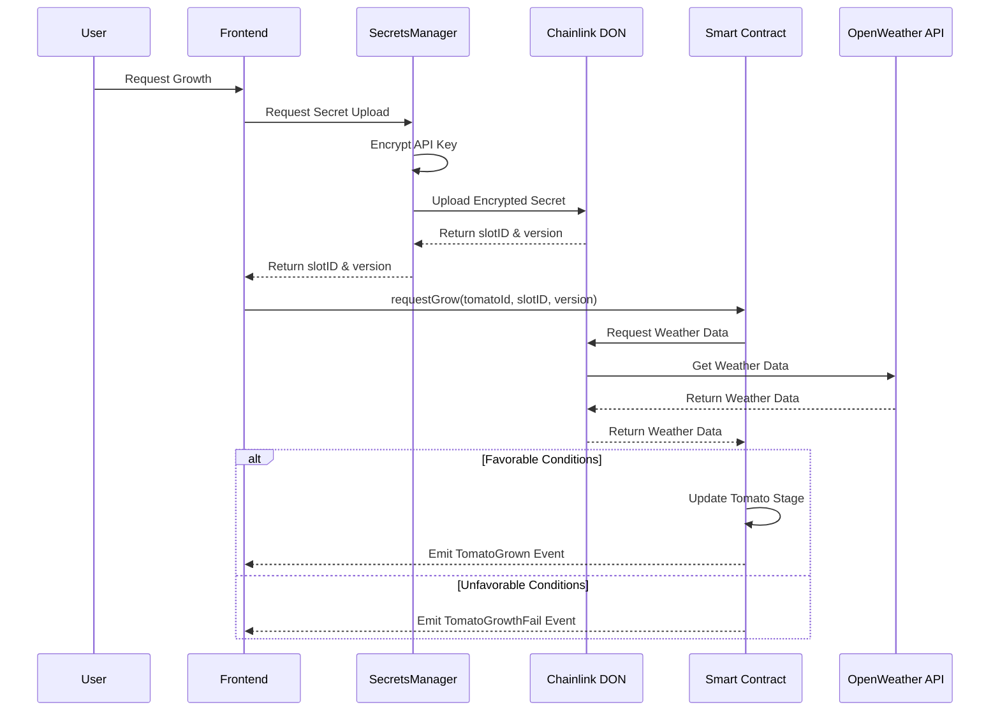

# DynamicTomatoes NFT

DynamicTomatoes is a project work developed as part of the Unina Blockchain & DApps course. The objective is to demonstrate the power of dynamic NFTs that evolve over time based on external data feeds obtained on-chain from the real-world through Chainlink's Functions ecosystem.

Users can mint virtual tomato plants as NFTs and grow them through various stages depending on the real weather conditions of Naples: if temperature and humidity are not favorable, basing on predefined requirements, growth requests will fail.

The project smart contract is deployed on Sepolia Ethereum testnet at <code>0xb8B47ABD98B56C3fa0fa3d9F991306ba3ab2f27B</code>

I hosted a [live demo](http://195.231.65.90:5173/) for the frontend

## Key Features

- **Dynamic NFTs**: Tomato NFTs evolve through 5 distinct growth stages based on real-world weather conditions
- **Chainlink Integration**: Utilizes Chainlink Functions to fetch real-time weather data securely
- **Interactive Frontend**: React-based web application for minting, viewing and growing tomato NFTs
- **Weather-Based Growth Logic**: Tomatoes only grow when temperature and humidity conditions are favorable or with a forced system allowed to the contract owner

## Architecture

The project follows a layered architecture:

1. **Smart Contract Layer**: Solidity contract deployed on Sepolia testnet
2. **Oracle Layer**: Chainlink DON (Decentralized Oracle Network) for secure API access
3. **Frontend Layer**: React/Vite application for user interaction
4. **Storage Layer**: IPFS via Pinata for decentralized metadata storage
5. **Secrets Management**: Local service for secure API key handling

## Project Structure

- **`/contracts`**: Solidity smart contracts
  - `DynamicTomatoes.sol`: Main NFT contract (implementing all the logic)
  - `ChainlinkTest.sol`: Test contract for Chainlink Functions
  - `NFTTest.sol`: Basic NFT implementation for testing
- **`/app`**: Frontend React application
- **`/scripts`**: Utility scripts
- **`/test`**: Smart contract tests

## Chain Logic Details

The `DynamicTomatoes.sol` contract implements all the chain logic:

- ERC721 NFT standard with URI storage for dynamic metadata
- Chainlink Functions integration for secure off-chain data retrieval
- Growth mechanics based on temperature (10-30°C) and humidity (40-90%) thresholds
- Events for tracking tomato lifecycle (minting, growth requests, successful growth, failed growth)
- Ownership management

The core of the project is the growth mechanism, here resumed in a sequence diagram

## Scripts and Tools

Trying to taking advantage of the hardhat development environment i

- **pinataUpload.js**: Uploads tomato images and metadata to IPFS via Pinata
- **openWeatherRequest.js**: Chainlink Functions compatible script for fetching weather data
- **wttrRequest.js**: Alternative weather data fetching implementation
- **estimateGas.js**: Utility for estimating transaction gas costs
- **hostSecrets.js**: API keys upload to the Chainlink DON

## Author

Simone Montella (M63001566)
