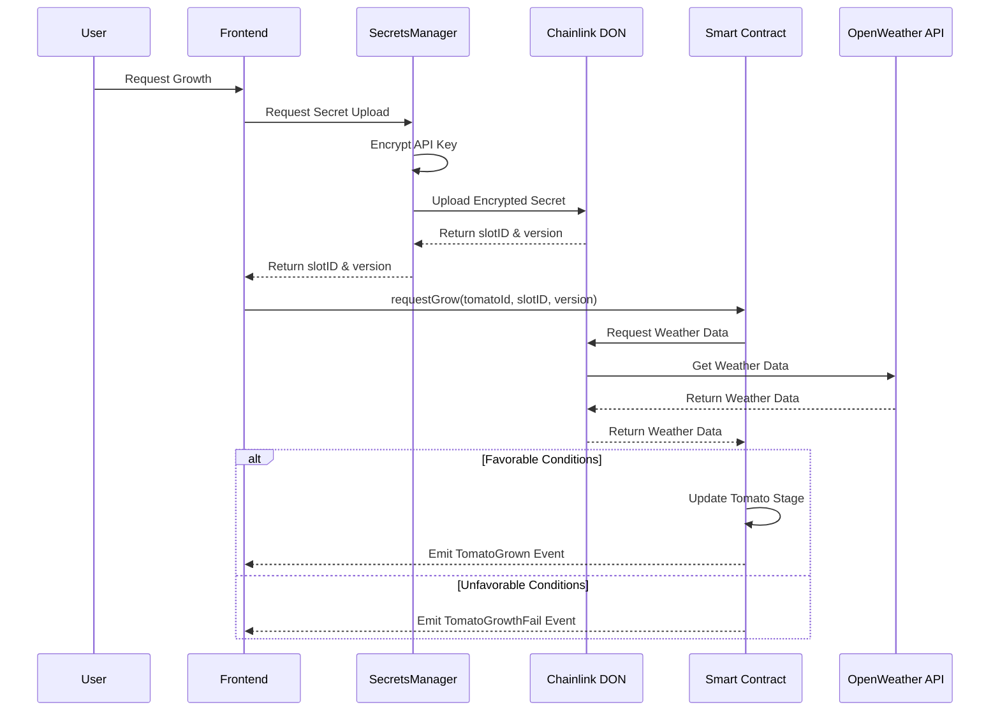

# DAPP

## Features

- **Connect Wallet**: Seamless integration with MetaMask for dapp interactions
- **Plant Tomatoes**: Mint new tomato NFTs
- **Growth**: Request tomato growth
- **NFT Visualization**: View tomato NFTs and their current growth stage
- **Event History**: Track all events related to tomatoes (planting, growth requests, successful growth, failures)
- **OpenSea Integration**: Direct links to view NFTs on OpenSea

## Tech Stack

- **Frontend**: React with TypeScript
- **UI Framework**: Material-UI (MUI)
- **Blockchain Integration**:
  - Wagmi for React hooks
  - Viem for Ethereum interactions
  - Alchemy SDK for NFT data
- **Weather Data**:
  - OpenWeather API through Chainlink Functions (on-chain)
  - wttr.in to display live data on the frontend
- **Development**:
  - Vite as build tool
  - TypeScript

## Growth Request Flow

1. The frontend initiates a growth request
2. The secrets manager service (running on port 3000) is contacted to:
   - Generate an encrypted secret containing the OpenWeather API key
   - Upload the secret to Chainlink's DON (Decentralized Oracle Network)
   - Return the slotID and version of the uploaded secret
3. The smart contract is called with:
   - The tomato's ID
   - The secret's slotID and version from step 2
4. Chainlink Functions retrieve the weather data using the secret
5. The smart contract processes the weather conditions and updates the tomato's state
6. An event is emitted (TomatoGrown or TomatoGrowthFail) based on the outcome

Notes:

- Growth requests will fail if the secret management service is not available
- Each growth request uploads a new secret that expires after 10 minutes

## Project Structure

- `/src`: Source code
  - `/chain`: Blockchain interaction logic
  - `/components`: React components
  - `/pages`: Application pages
  - `/theme`: Theme configuration
- `/secrets-manager`: Weather data integration service

## Author

Simone Montella (M63001566)
